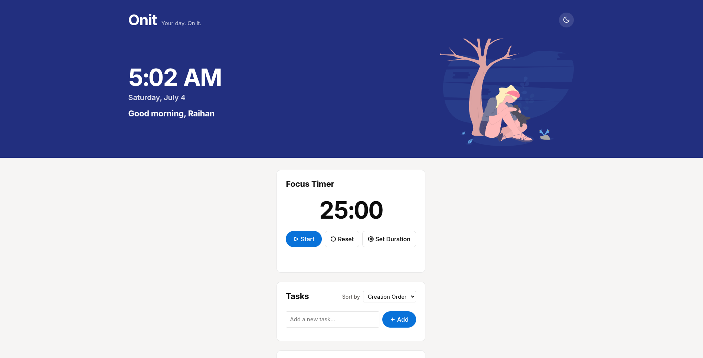
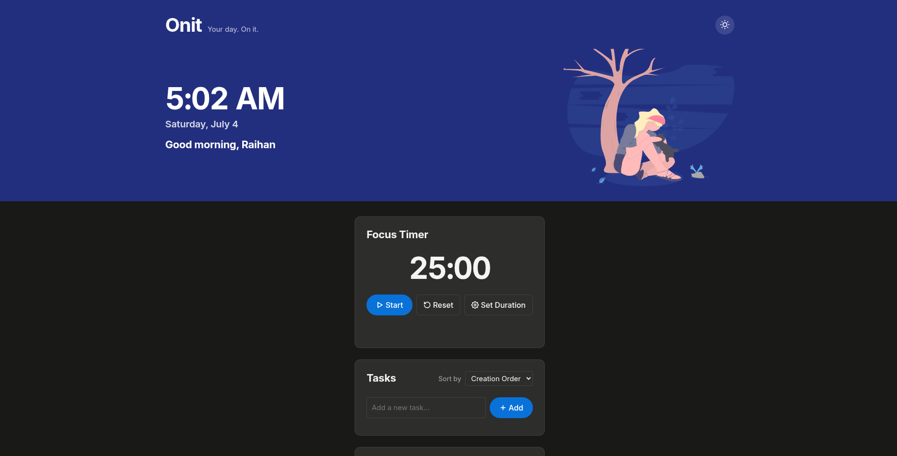

# Onit — Your day. On it.

A calm daily dashboard for focus, tasks, and quick links. Built with vanilla HTML, CSS, and JavaScript — no frameworks, no build tools.

## Features

- **Focus Timer** — Pomodoro-style timer with custom duration
- **Tasks** — Add, complete, edit, delete, and sort tasks
- **Quick Links** — Bookmark frequently visited URLs
- **Dark / Light theme** — Toggle between warm daylight and night mode
- **Local storage** — All data persists in the browser, no backend needed

## Screenshots

### Light Mode

### Dark Mode

## Tech Stack

- HTML, CSS, JavaScript (vanilla)
- [Inter](https://fonts.google.com/specimen/Inter) font from Google Fonts
- [unDraw](https://undraw.co) illustration (Focus, recolored)

## Usage

Open `index.html` in any modern browser. That's it.
